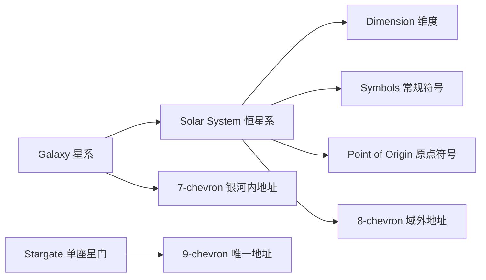
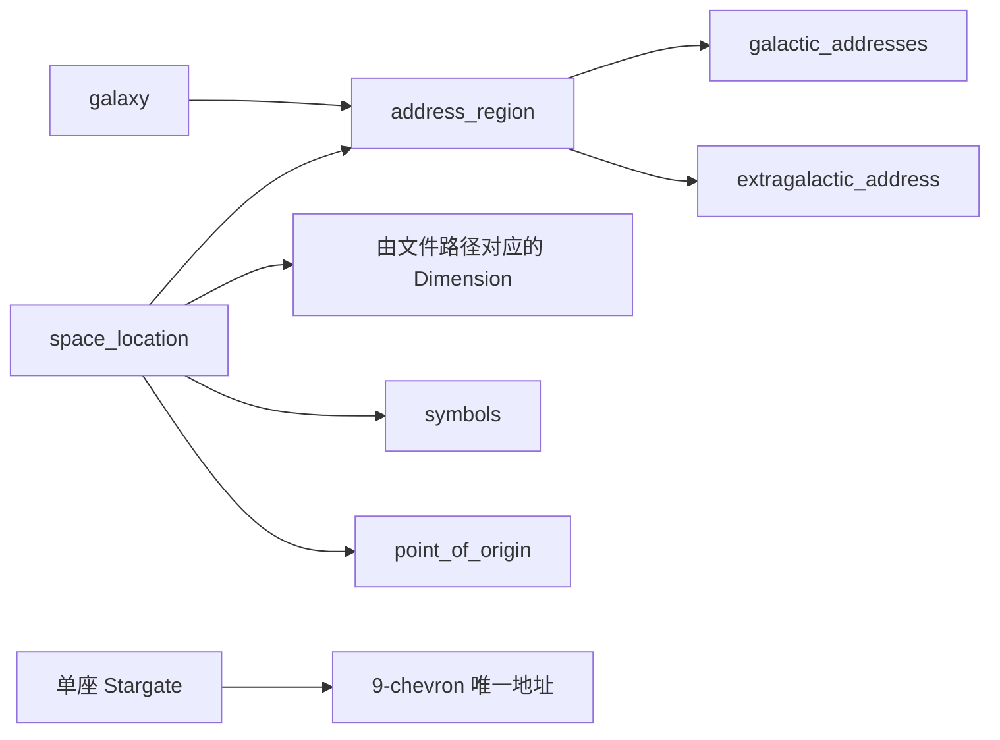

# Stargate Journey Wiki 与数据包开发参考

> 整理日期：2026-08-06  
> Wiki 快照：`d2d2203b929ad82db22c230a3299271cb08bb3a7`（2024-09-28）  
> 官方示例数据包快照：`3168dfdbf10e1a962e206406bc6926d40fa8e97c`（2024-01-08）  
> 当前整合包实装版本：Minecraft 1.20.1 / Stargate Journey 0.6.46

## 1. 文档范围与证据等级

本文逐页阅读了 [Stargate Journey GitHub Wiki](https://github.com/Povstalec/StargateJourney/wiki) 的全部 24 个 Markdown 页面，并重点核对：

- 星门、星门网络、恒星系与星系的关系；
- 全部已记录星系、恒星系、地址与维度归属；
- 数据包、资源包、自定义符号、原点符号、地址表、结构生成与星门变体；
- CC:Tweaked 外设函数、事件、命令、兼容与排障；
- Wiki、官方示例包与本整合包 0.6.46 实际 JAR 之间的格式差异。

本文使用以下标记区分事实来源：

| 标记 | 含义 |
|---|---|
| **Wiki** | Wiki 页面明确陈述的机制或格式 |
| **示例 0.6.8** | Wiki 链接的官方示例包；其页面称目标版本为 Minecraft 1.20.1 / SGJourney 0.6.8 |
| **本地 0.6.46** | 直接读取 `mods/Stargate.Journey-1.20.1-0.6.46.jar` 得到的内置资源事实 |
| **未文档化** | Wiki 没有说明，且未检查源码 Codec；不能据此断言字段必填性、默认值或完整约束 |

关键结论：**Wiki 的概念模型仍有参考价值，但其中的数据包 JSON 已不能直接作为 0.6.46 的开发模板。** 0.6.46 已把旧 `solar_system` 拆成 `address_region` 与按维度绑定的 `space_location`，并把符号、PoO 和星门变体拆成服务端数据与客户端资源两层。

## 2. 核心概念模型

### 2.1 Wiki 时代模型



### 2.2 本地 0.6.46 模型



迁移关系不是简单改名：

| Wiki / 0.6.8 | 本地 0.6.46 |
|---|---|
| `solar_system.dimensions[]` | 每个维度各自拥有一个 `space_location` 文件 |
| `solar_system.addresses[]` | `address_region.galactic_addresses` |
| `solar_system.extragalactic_address` | `address_region.extragalactic_address` |
| Solar System 同时管理显示与地址 | `space_location` 管位置属性，`address_region` 管共享地址 |
| `symbol_set` 独立数据目录 | JAR 未观察到该目录；客户端 `symbols` 内仍有 `symbol_set` 标识 |
| 数据 JSON 直接写名称和纹理 | 服务端对象引用 `client_*`，资源包侧再写名称和纹理 |

## 3. 地址、连接与星门网络

### 3.1 三类地址

Wiki 将地址按最终啮合的 Chevron 数量命名。页面中书写的数字通常**不包含最后按下的 PoO（编号 0）**：

| 地址 | 页面中数字数 | 作用域 | 唯一性 |
|---|---:|---|---|
| 7-chevron | 6 | 同一星系内定位地址区域/恒星系 | 同一对象在不同星系可有不同地址 |
| 8-chevron | 7 | 从任意星系定位地址区域/恒星系 | 每个对象一套域外地址 |
| 9-chevron | 8 | 精确定位单座星门 | 每座星门唯一，移动后仍保持 |

常规符号编号从 1 开始；PoO 固定视为编号 0。不同星系的图案可以不同，但底层仍按数字工作。

### 3.2 连接类型与 Wiki 默认能耗

| 连接 | 条件 | 可用地址 | Wiki 默认能耗 |
|---|---|---|---:|
| System-wide | 同维度或同一恒星系/地址区域 | 仅 9-chevron | 50,000 FE |
| Interstellar | 同一星系 | 7、8、9-chevron | 100,000 FE |
| Intergalactic | 不同星系，或目标不属于任何星系 | 8、9-chevron | 100,000,000,000 FE |

Wiki 同时说明能耗机制默认关闭，可在配置中启用。具体 0.6.46 配置名和默认值应以本地 `config/sgjourney-common.toml` 为准。

### 3.3 首选星门选择顺序

使用 7/8-chevron 地址时，一个目标区域可能有多座星门。网络按以下顺序选择 Preferred Stargate：

1. 有可用 DHD，保证旅客可以返回；
2. 代际更高：Pegasus（第 3 代）优先于 Milky Way（第 2 代），后者优先于 Universe（第 1 代）；
3. 历史使用次数更多。

### 3.4 三种 Wiki 星门

| 星门 | 代际 | 符号能力 | 放置/破坏行为 | 手动拨号 |
|---|---:|---|---|---|
| Universe Stargate | 1 | 36 个位置，不能拨 35 以上；固定 Universal Symbols | 固定符号 | Wiki 未列为可手拨 |
| Milky Way Stargate | 2 | 39 个位置，不能拨 38 以上 | 首次放置适配所在恒星系；破坏后记住所用符号 | 支持 |
| Pegasus Stargate | 3 | 同时显示 36 个，但可拨任意符号 | 放到新恒星系后切换当地符号 | Wiki 未列为可手拨 |

本地 0.6.46 还包含 Tollan 相关客户端外观资源；Wiki 的三种变体页并不是 0.6.46 全部可见内容清单。

### 3.5 Stellar Update

Stellar Update 会断开全部星门，并从世界状态重新生成星门网络；新增维度要到下一次更新才会注册。Wiki 给出三种触发方式：

1. 模组升级包含新的网络版本；
2. 执行 `/sgjourney stargateNetwork forceStellarUpdate`；
3. 离线删除世界 `data` 目录里的星门网络存档，再进世界重建。

离线操作前必须备份世界。详见第 12 节的安全警告。

### 3.6 网络版本历史

| 网络版本 | 首次使用 | 最后使用 / Wiki 状态 | 关键变化 |
|---:|---|---|---|
| 0 | 0.4.0 | 0.5.1 | 使用每恒星系最老星门作为 Primary Stargate |
| 1 | 0.5.2 | 0.5.4 | Wiki 未列具体变化 |
| 2 | 0.6.0 | 0.6.0 | 用 Preferred Stargate 替代 Primary Stargate |
| 3 | 0.6.1 | 0.6.2 | 修改 Nether 与 End 的银河内地址 |
| 4 | 0.6.3 | 0.6.5 | Wiki 未列具体变化 |
| 5 | 0.6.6 | 未注明 | 被拨号端逐个锁定 Chevron，直到虫洞形成 |
| 6 | 未注明 | 未注明 | Wiki 为空 |
| 7 | 0.6.10 | Wiki 称 0.6.10 时仍在使用 | 修改 Abydos 与 Chulak 的域外地址 |

本整合包已是 0.6.46，因此这张表只能视作历史记录，不能证明当前网络版本仍为 7。

## 4. Wiki 明确记录的全部星系与恒星系

### 4.1 星系尺寸

| 类型 ID 语义 | Wiki 显示名 | 最大符号数 |
|---|---|---:|
| `dwarf_galaxy` | Dwarf Galaxy | 36 |
| `medium_galaxy` | Medium Galaxy | 39 |
| `large_galaxy` | Large Galaxy | 42 |
| `giant_galaxy` | Giant Galaxy | 45 |
| `supergiant_galaxy` | Supergiant Galaxy | 48 |

Wiki 特别说明：当时星系尺寸仅用于限制星系内随机生成的 7-chevron 地址。

### 4.2 Wiki 的两个星系

| 星系 | 类型 | 特性 | Wiki 所列成员 |
|---|---|---|---|
| Milky Way | Medium / 39 | 默认星系；开启随机地址时，模组新增维度会被分配到其中的随机恒星系 | Terra、Nether、End、Abydos、Chulak、Cavum Tenebrae |
| Pegasus | Dwarf / 36 | Wiki 未列额外默认行为 | Lantea、End |

`End` 同时属于两个星系，因此拥有两套 7-chevron 地址。

### 4.3 Wiki 的七个恒星系

| 恒星系 | 星系 | Wiki 维度 | PoO | Symbols | 8-chevron 数字段 | 7-chevron 数字段 |
|---|---|---|---|---|---|---|
| Terra | Milky Way | `minecraft:overworld`；Ad Astra 的 Earth Orbit、Moon、Moon Orbit、Mars、Mars Orbit、Mercury、Mercury Orbit、Venus、Venus Orbit | Terra | Milky Way | `1-35-4-31-15-30-32` | MW `27-25-4-35-10-28` |
| Nether | Milky Way | `minecraft:the_nether` | Wither | Milky Way | `1-35-6-31-15-28-32` | MW `27-23-4-34-12-28` |
| End | Milky Way、Pegasus | `minecraft:the_end` | Ender Eye | Milky Way | `18-24-8-16-7-35-30` | MW `13-24-2-19-3-30`；Pegasus `14-30-6-13-17-23` |
| Abydos | Milky Way | `sgjourney:abydos` | Abydos | Milky Way | `1-17-2-34-26-9-33` | MW `26-6-14-31-11-29` |
| Chulak | Milky Way | `sgjourney:chulak` | Apophis | Milky Way | `1-9-14-21-17-3-29` | MW `8-1-22-14-36-19` |
| Cavum Tenebrae | Milky Way | `sgjourney:cavum_tenebrae` | Dark Star | Milky Way | `1-34-12-18-7-31-6` | MW `18-7-3-36-25-15` |
| Lantea | Pegasus | `sgjourney:lantea` | Subido | Pegasus | `18-20-1-15-14-7-19` | Pegasus `29-5-17-34-6-12` |

## 5. 本地 0.6.46 的全部星系与地址区域

本节不是 Wiki 原文，而是当前整合包 JAR 的直接观察结果。它比 Wiki 更适合指导当前项目，但未检查 Java Codec，因此未出现的默认值不得自行假定。

### 5.1 数据对象数量

`data/sgjourney/sgjourney/` 下观察到：

| 目录 | JSON 数量 |
|---|---:|
| `address_region` | 13 |
| `address_table` | 8 |
| `galaxy` | 7 |
| `point_of_origin` | 39 |
| `space_location` | 9 |
| `stargate_variant` | 5 |
| `symbols` | 22 |

此外，原版和兼容模组命名空间下还有维度专属 `space_location` 文件。

### 5.2 七个内置星系

| 注册 ID | `type` / Wiki 尺寸 | `default_symbols` | `symbol_prefix` | 随机区域字段 | 内置地址区域 |
|---|---|---|---:|---|---|
| `sgjourney:andromeda` | Large / 42 | `sgjourney:galaxy_andromeda` | 22 | 未出现 | 无 |
| `sgjourney:ida` | Dwarf / 36 | `sgjourney:galaxy_pegasus` | 10 | 未出现 | Othala |
| `sgjourney:kaliem` | Medium / 39 | `sgjourney:galaxy_kaliem` | 26 | 未出现 | 无 |
| `sgjourney:milky_way` | Medium / 39 | `sgjourney:galaxy_milky_way` | 1 | `can_generate_address_regions: true` | Abydos、Cavum Tenebrae、Chulak、End、Nether、Proxima Centauri、Rima、Terra、Tollan、Unitas |
| `sgjourney:othala` | Dwarf / 36 | `sgjourney:galaxy_pegasus` | 22 | 未出现 | 无 |
| `sgjourney:pegasus` | Dwarf / 36 | `sgjourney:galaxy_pegasus` | 18 | 未出现 | Athos、End、Lantea |
| `sgjourney:triangulum` | Dwarf / 36 | `sgjourney:galaxy_triangulum` | 23 | 未出现 | 无 |

两个需要原样记录、不能擅自解释的 JAR 事实：

- `ida.json` 的 `name` 是 `galaxy.sgjourney.pegasus`，默认符号也是 Pegasus；
- `othala.json` 的 `name` 同样是 `galaxy.sgjourney.pegasus`，默认符号也是 Pegasus。

这可能是有意复用，也可能是数据错误。仅凭资源文件无法裁决。

### 5.3 十三个内置地址区域

下表地址仍省略最终 PoO。`End` 在两个星系的成员计数中会重复一次。

| 地址区域 | PoO | Symbols | 8-chevron 数字段 | 7-chevron 数字段 | 已观察维度绑定 |
|---|---|---|---|---|---|
| `sgjourney:abydos` | `sgjourney:abydos` | `sgjourney:abydos` | `1-17-2-34-26-9-33` | MW `26-6-14-31-11-29` | `sgjourney:abydos` |
| `sgjourney:athos` | `sgjourney:athos` | `sgjourney:athos` | `18-21-14-24-1-26-28` | Pegasus `21-14-24-1-26-28` | `sgjourney:athos` |
| `sgjourney:cavum_tenebrae` | `sgjourney:dark_star` | `sgjourney:cavum_tenebrae` | `1-34-12-18-7-31-6` | MW `18-7-3-36-25-15` | `sgjourney:cavum_tenebrae` |
| `sgjourney:chulak` | `sgjourney:chulak` | `sgjourney:chulak` | `1-9-14-21-17-3-29` | MW `8-1-22-14-36-19` | `sgjourney:chulak` |
| `sgjourney:end` | `sgjourney:pontem` | `sgjourney:end` | `18-24-8-16-7-35-30` | MW `13-24-2-19-3-30`；Pegasus `14-30-6-13-17-23` | `minecraft:the_end` |
| `sgjourney:lantea` | `sgjourney:subido` | `sgjourney:lantea` | `18-20-1-15-14-7-19` | Pegasus `29-5-17-34-6-12` | `sgjourney:lantea` |
| `sgjourney:nether` | `sgjourney:wither` | `sgjourney:nether` | `1-35-6-31-15-28-32` | MW `27-23-4-34-12-28` | `minecraft:the_nether` |
| `sgjourney:othala` | `sgjourney:othala` | `sgjourney:othala` | `10-26-22-15-32-2-8` | Ida `1-6-13-3-35-8` | JAR 中未观察到对应 `space_location` |
| `sgjourney:proxima_centauri` | `sgjourney:centauri` | `sgjourney:centauri` | `1-36-28-4-6-26-22` | MW `26-20-4-36-9-27` | `ad_astra:glacio`、`ad_astra:glacio_orbit` |
| `sgjourney:rima` | `sgjourney:rima` | `sgjourney:rima` | `1-31-21-8-19-2-9` | MW `33-20-10-22-3-17` | `sgjourney:rima` |
| `sgjourney:terra` | `sgjourney:terra` | `sgjourney:terra` | `1-35-4-31-15-30-32` | MW `27-25-4-35-10-28` | Overworld；Ad Astra 的 Earth Orbit、Moon、Moon Orbit、Mars、Mars Orbit、Mercury、Mercury Orbit、Venus、Venus Orbit |
| `sgjourney:tollan` | `sgjourney:tollan` | `sgjourney:tollan` | `1-9-29-21-38-10-18` | MW `5-32-26-36-10-17` | `sgjourney:tollan` |
| `sgjourney:unitas` | `sgjourney:unitas` | `sgjourney:unitas` | `1-12-34-24-15-8-17` | MW `2-27-8-34-24-15` | `sgjourney:unitas` |

另有 `sgjourney:destiny` 空间位置：使用 Universal PoO/Symbols、`preload_stargate: true`，但没有绑定 `address_region`。

### 5.4 Wiki 与 0.6.46 的显著资料差异

- Wiki 只列 2 个星系；0.6.46 内置 7 个。
- Wiki 只列 7 个恒星系；0.6.46 内置 13 个地址区域。
- Wiki 的 Chulak PoO 是 Apophis；0.6.46 地址区域与空间位置都使用 `sgjourney:chulak`。
- Wiki 的 End PoO 是 Ender Eye；0.6.46 使用 `sgjourney:pontem`。
- Wiki 的 Galaxy/Solar System 页和 0.6.46 JAR 都给 Pegasus End 地址 `14-30-6-13-17-23`；Commands 页和网络 v3 说明却写过 `19-30-6-13-3-24`。

## 6. 数据包：Wiki 所描述的旧格式

本节用于理解 Wiki 与维护旧包，不应直接复制到 0.6.46。

### 6.1 Wiki 宣称可自定义的内容

- Address Tables；
- Symbols、Symbol Sets、Points of Origin；
- Solar Systems；
- Galaxies；
- Stargate Variants（0.6.9+）。

Wiki 没有给出 Address Table 或 Stargate Variant 的 JSON 教程，只给了其余对象。

### 6.2 旧格式路径与字段

| 对象 | Wiki 路径 | Wiki 字段 |
|---|---|---|
| PoO | `data/<namespace>/sgjourney/point_of_origin/<id>.json` | `name`、`texture`、`generated_galaxies[]` |
| Symbol Set | `data/<namespace>/sgjourney/symbol_sets/<id>.json` | `name`、`texture`、`size` |
| Symbols | `data/<namespace>/sgjourney/symbols/<id>.json` | `name`、`symbol_set`、`texture`、`size` |
| Solar System | `data/<namespace>/sgjourney/solar_system/<id>.json` | `name`、`symbols`、`symbol_prefix`、`extragalactic_address`、`addresses[]`、`point_of_origin`、`dimensions[]` |
| Galaxy | `data/<namespace>/sgjourney/galaxy/<id>.json` | `name`、`type`、`default_symbols` |

旧 Solar System 地址约束按 Wiki 原文为：

- `extragalactic_address.address` 是 7 个大于等于 1 的数字；
- `addresses[].address.address` 是 6 个大于等于 1 的数字；
- 两层地址对象都可有 `randomizable`；
- `symbol_prefix` 用于随机生成域外地址，Wiki 给出 Milky Way = 1、Pegasus = 18；
- `dimensions[]` 中的所有维度共享同一恒星系地址。

### 6.3 官方 0.6.8 示例与 Wiki 自身也不一致

官方示例使用：

- `sgjourney/symbol_set`（单数），不是 Wiki 的 `symbol_sets`；
- Symbol Set / Symbols 的 `textures[]`，不是单个 `texture` 加 `size`；
- PoO 的 `generates_randomly`，不是 `generated_galaxies[]`；
- Galaxy 的 `solar_systems[]` 反向登记恒星系和地址；
- Solar System 示例没有 Wiki 所写的 `addresses[]`。

所以即便开发 0.6.8，也应固定到明确的模组小版本并复制同版本内置数据，不应混搭 Wiki 与示例仓库。

### 6.4 结构生成的 Wiki 做法

要让某类 Stargate Pedestal 在目标维度生成，Wiki 要求把该维度**全部会生成的生物群系**加入对应标签。路径位于：

`data/sgjourney/tags/worldgen/biome/has_structure/stargate_pedestal/`

可覆盖的标签文件：

- `stargate_pedestal_biomes.json`
- `stargate_pedestal_badlands_biomes.json`
- `stargate_pedestal_deep_dark_biomes.json`
- `stargate_pedestal_desert_biomes.json`
- `stargate_pedestal_jungle_biomes.json`
- `stargate_pedestal_mushroom_biomes.json`
- `stargate_pedestal_snow_biomes.json`
- `stargate_pedestal_chulak_biomes.json`

标签结构：

```json
{
  "replace": false,
  "values": [
    "my_pack:example_biome",
    "#my_pack:is_example_dimension"
  ]
}
```

这里必须扩展 `sgjourney` 命名空间下的模组标签，而不是随意换成自有命名空间。

## 7. 数据包：本地 0.6.46 实际格式

### 7.1 普通数据包与 KubeJS 路径

普通世界数据包：

```text
saves/<world>/datapacks/<pack>/
├─ pack.mcmeta
└─ data/
```

Minecraft 1.20.1 的示例 `pack.mcmeta`：

```json
{
  "pack": {
    "pack_format": 15,
    "description": "Stargate Journey custom network data"
  }
}
```

在本整合包通过 KubeJS 提供数据时，把普通数据包的命名空间目录直接放进 `kubejs/data/`；客户端资源放进 `kubejs/assets/`。ATM9 排障页也采用“把数据包 `data` 下的命名空间目录复制进 `kubejs/data`”的方式。

### 7.2 Galaxy

路径：`data/<namespace>/sgjourney/galaxy/<id>.json`

```json
{
  "name": "galaxy.my_pack.example",
  "type": "sgjourney:dwarf_galaxy",
  "default_symbols": "my_pack:galaxy_example",
  "symbol_prefix": 21,
  "can_generate_address_regions": true
}
```

已观察字段：

| 字段 | 0.6.46 观察含义 |
|---|---|
| `name` | 翻译键 |
| `type` | 星系尺寸类型；Wiki 列出的五个 `sgjourney:*_galaxy` ID |
| `default_symbols` | 自动生成地址区域时使用的 Symbols ID |
| `symbol_prefix` | 域外地址前缀 |
| `can_generate_address_regions` | 仅在内置 Milky Way 中明确出现为 `true`；缺省行为未检查 Codec |

### 7.3 Address Region

路径：`data/<namespace>/sgjourney/address_region/<id>.json`

```json
{
  "name": "solar_system.my_pack.example",
  "point_of_origin": "my_pack:example",
  "symbols": "my_pack:example",
  "symbol_prefix": 21,
  "extragalactic_address": {
    "symbols": [21, 8, 6, 13, 27, 35, 22],
    "randomizable": true
  },
  "galactic_addresses": {
    "my_pack:example": {
      "address": {
        "symbols": [13, 8, 22, 19, 3, 33],
        "randomizable": true
      }
    }
  }
}
```

注意 0.6.46 使用 `symbols` 作为数字数组字段，而旧 Wiki 使用 `address`。`galactic_addresses` 是以 Galaxy ID 为键的对象，不是列表。

### 7.4 Space Location：把维度绑定到地址区域

固定维度路径：

`data/<dimension_namespace>/sgjourney/space_location/<dimension_path>.json`

例如为 `my_pack:example_dimension` 创建：

`data/my_pack/sgjourney/space_location/example_dimension.json`

```json
{
  "point_of_origin": "my_pack:example",
  "symbols": "my_pack:example",
  "address_region": "my_pack:example"
}
```

多个维度可指向同一 `address_region`，从而共享 7/8-chevron 地址。

本地 JAR 还观察到以下附加字段或结构，但 Wiki 未说明其完整约束：

| 字段 | 出现实例 |
|---|---|
| `parent_gravity` | Cavum Tenebrae 为 `0.07` |
| `unity_crystals_grow` | Unitas 为 `true` |
| `preload_stargate` | Destiny 为 `true` |
| `in_stargate_network` | AE2/Compact Machines/ISS Pocket Dimension 中为 `false` |
| `generate_in_address_tables` | 上述排除维度中为 `false` |
| `template_info` | RFTools Dimensions 动态维度模板，含 `prefix`、`generate_address_region`、`galaxies` |

不要仅凭这几个内置实例推断字段默认值。

### 7.5 Symbols：服务端与客户端拆分

服务端路径：`data/<namespace>/sgjourney/symbols/<id>.json`

```json
{
  "client_symbols": "my_pack:example"
}
```

客户端路径：`assets/<namespace>/sgjourney/symbols/<id>.json`

```json
{
  "name": "symbols.my_pack.example",
  "symbol_set": "my_pack:galaxy_example",
  "textures": [
    "my_pack:symbol/example/1",
    "my_pack:symbol/example/2"
  ]
}
```

上例只展示结构；实际 `textures` 必须按目标符号集提供完整、有序的纹理列表。纹理资源 ID `my_pack:symbol/example/1` 对应：

`assets/my_pack/textures/symbol/example/1.png`

0.6.46 JAR 中没有观察到独立 `symbol_set` JSON 目录，但客户端 Symbols 仍要求 `symbol_set` 标识。该标识的注册与校验规则属于未文档化内容。

### 7.6 Point of Origin：服务端与客户端拆分

服务端路径：`data/<namespace>/sgjourney/point_of_origin/<id>.json`

```json
{
  "client_point_of_origin": "my_pack:example",
  "generated_galaxies": [
    "my_pack:example"
  ]
}
```

客户端路径：`assets/<namespace>/sgjourney/point_of_origin/<id>.json`

```json
{
  "name": "point_of_origin.my_pack.example",
  "texture": "my_pack:symbol/example/point_of_origin/example"
}
```

对应纹理：

`assets/my_pack/textures/symbol/example/point_of_origin/example.png`

### 7.7 Address Table

路径：`data/<namespace>/sgjourney/address_table/<id>.json`

0.6.46 内置格式：

```json
{
  "include_generated_addresses": false,
  "addresses": [
    {
      "address": {
        "dimension": "sgjourney:abydos",
        "galaxy": "sgjourney:milky_way"
      },
      "weight": 1
    }
  ]
}
```

字段观察：

- `include_generated_addresses` 控制是否把随机/自动生成地址纳入候选；
- `addresses[]` 是加权条目；
- `address.dimension` 指目标维度；
- `address.galaxy` 指从哪个星系取该目标的 7-chevron 地址；
- `weight` 是该条目的相对权重。

官方旧示例使用过 `dimensions[]`，且没有 `galaxy`；不要用于 0.6.46。

Cartouche 类似带 Loot Table 的容器：自然生成结构可绑定 Address Table，玩家直接放置的 Cartouche 默认只显示所在维度地址。Wiki 的 Cartouche 独立页面仍是 `TBD`，未说明 0.6.46 如何把表 ID 绑定到方块实体。

### 7.8 Stargate Variant

服务端路径：`data/<namespace>/sgjourney/stargate_variant/<id>.json`

```json
{
  "base_stargate": "sgjourney:milky_way_stargate",
  "client_variant": "my_pack:example"
}
```

客户端路径位于：

`assets/<namespace>/sgjourney/stargate_variant/<family>/<id>.json`

内置 Milky Way SG-1 客户端模板的顶层配置包含：

- `texture`、`engaged_texture`；
- `wormhole`、`shiny_wormhole`；
- `symbols`；
- `stargate_model`；
- `chevron_engaged_sounds`、`chevron_incoming_sounds`、`chevron_open_sounds`；
- `rotation_sounds`、`wormhole_sounds`、`fail_sounds`。

该客户端格式在 Wiki 中完全未文档化。开发时应从**同版本、同一 base_stargate 家族**的内置客户端 JSON 复制模板，再逐项替换资源，不能从上述字段名单推断完整结构。

### 7.9 翻译与纹理

客户端 JSON 的 `name` 是翻译键，应写入：

`assets/<namespace>/lang/zh_cn.json`、`en_us.json` 等。

数据包本身不能向客户端发送纹理。普通部署必须同时提供资源包，服务器可通过 server resource pack 分发。当前 KubeJS 实例可把等价资源放在 `kubejs/assets/`。

### 7.10 推荐开发闭环

1. 固定 Minecraft 与 SGJourney 精确版本；本文当前目标为 1.20.1 / 0.6.46。
2. 从同版本 JAR 找同类内置 JSON，不跨版本拼字段。
3. 先创建 Galaxy、Symbols、PoO、Address Region，再为每个维度创建 Space Location。
4. 客户端 Symbols/PoO/Variant 与服务端引用使用同一资源 ID 闭环。
5. 普通包检查 `pack.mcmeta`；KubeJS 包检查 `kubejs/data` 与 `kubejs/assets` 层级。
6. 查看游戏日志中的数据包解码错误。
7. 让网络执行 Stellar Update，再用地址命令核验归属与地址。
8. 在测试世界验证 7、8、9-chevron 拨号、PoO、纹理、Cartouche 和结构生成。

从本地 JAR 读取模板的 PowerShell 命令：

```powershell
jar tf 'mods\Stargate.Journey-1.20.1-0.6.46.jar'
tar -xOf 'mods\Stargate.Journey-1.20.1-0.6.46.jar' 'data/sgjourney/sgjourney/galaxy/milky_way.json'
```

## 8. 命令参考

Wiki 中所有模组命令以 `/sgjourney` 开始，以下均标记为不可在普通 Survival 权限下使用：

| 命令 | Wiki 作用 |
|---|---|
| `/sgjourney stargateNetwork address [dimension]` | 返回目标维度在玩家当前所在星系中的 7-chevron 地址；若玩家维度属于多个星系，会返回多套 |
| `/sgjourney stargateNetwork extragalacticAddress [dimension]` | 返回目标维度的 8-chevron 地址 |
| `/sgjourney stargateNetwork forceStellarUpdate` | 强制 Stellar Update |
| `/sgjourney stargateNetwork getAllStargates [dimension]` | 返回目标维度内已注册星门的位置和 9-chevron 地址 |
| `/sgjourney stargateNetwork version` | 返回网络版本 |
| `/sgjourney ringsNetwork getAllRings [dimension]` | 返回目标维度内已注册 Transport Rings 的位置 |

创意模式定位结构：

| 命令 | 目标 |
|---|---|
| `/locate structure #sgjourney:has_stargate` | 最近的任意含星门结构 |
| `/locate structure #sgjourney:stargate_pedestal` | 最近的 Stargate Pedestal |
| `/locate structure #sgjourney:buried_stargate` | 最近的 Buried Stargate |

0.6.46 的实际 Brigadier 子命令可能已扩展；游戏内补全和当前 JAR 优先于 Wiki 表。

## 9. CC:Tweaked 开发接口

### 9.1 Interface 等级

| Interface | 外设名 | 记号 |
|---|---|---|
| Basic Interface | `basic_interface` | B |
| Crystal Interface | `crystal_interface` | C |
| Advanced Crystal Interface | `advanced_crystal_interface` | A |

Interface 同时承担控制和供能。为避免星门早期抽干电网，它默认只向目标设备充到 Energy Target；Wiki 示例称星门容量可达数十亿 FE，而默认目标只有 200,000 FE。

### 9.2 通用函数

| 函数 | 等级 | 作用 |
|---|---|---|
| `getEnergy()` | BCA | Interface 当前能量 |
| `getEnergyTarget()` | BCA | 当前 Energy Target |
| `setEnergyTarget(long targetEnergy)` | BCA | 设置 Energy Target |
| `addressToString(int[] address)` | BCA | 把数字数组格式化成 `-26-6-...-` |

### 9.3 连接任意 Stargate 后的函数

| 函数 | 等级 | 作用 |
|---|---|---|
| `getStargateGeneration()` | BCA | 星门代际 |
| `getStargateType()` | BCA | 星门注册 ID |
| `getStargateEnergy()` | BCA | 星门储能 FE |
| `disconnectStargate()` | BCA | 已连接则断开，否则重置 |
| `getChevronsEngaged()` | BCA | 已啮合 Chevron 数 |
| `getOpenTime()` | BCA | 活跃 tick 数；未激活为 0 |
| `isStargateConnected()` | BCA | 是否已连接 |
| `isStargateDialingOut()` | BCA | 是否为本端主动拨出 |
| `isWormholeOpen()` | BCA | 虫洞是否形成 |
| `getRecentFeedback()` | BCA | 最近反馈；Basic 只给整数，Crystal/Advanced 还给文本名 |
| `sendStargateMessage(String message)` | BCA | 向对端发送消息；Advanced 可在连接建立后立即发送，其余需等虫洞完全形成 |
| `engageSymbol(int symbol)` | CA | 直接编码符号 |
| `getDialedAddress()` | CA | 本端拨出的地址；入站连接时为空 |
| `setChevronConfiguration(int[] configuration)` | CA | 设置 Chevron 啮合顺序；星门重置时恢复 |
| `getConnectedAddress()` | A | 对端地址 |
| `getLocalAddress()` | A | 本星门 9-chevron 地址 |
| `getNetwork()` | A | 星门所属网络数字 ID |
| `setNetwork(int network)` | A | 设置网络 ID |
| `isNetworkRestricted()` | A | 是否拒绝外部网络连接 |
| `restrictNetwork(boolean shouldRestrictNetwork)` | A | 开关外部网络限制 |

### 9.4 Milky Way Stargate 专用函数

| 函数 | 等级 | 作用 |
|---|---|---|
| `rotateAntiClockwise(int symbol)` | BCA | 逆时针转到目标符号；`-1` 为持续转动 |
| `rotateClockwise(int symbol)` | BCA | 顺时针转到目标符号；`-1` 为持续转动 |
| `endRotation()` | BCA | 停止旋转并播放停止声 |
| `getRotation()` | BCA | 当前角度 |
| `getCurrentSymbol()` | BCA | 顶部当前符号 |
| `isCurrentSymbol(int symbol)` | BCA | 判断顶部是否为目标符号 |
| `openChevron()` | BCA | 可用时抬起 Chevron |
| `closeChevron()` | BCA | 可用时放下 Chevron |
| `encodeChevron()` | BCA | Chevron 保持打开时编码当前符号；不能编码 Primary Chevron |

### 9.5 Pegasus Stargate 专用函数

| 函数 | 等级 | 作用 |
|---|---|---|
| `dynamicSymbols(boolean useDynamicSymbols)` | A | 开关按放置位置动态选择符号 |
| `overrideSymbols(String symbols)` | A | 覆盖使用的 Symbols；若动态模式未关闭，重新加载时会恢复 |
| `overridePointOfOrigin(String pointOfOrigin)` | A | 覆盖 PoO；若动态模式未关闭，重新加载时会恢复 |

### 9.6 ComputerCraft 事件

| 事件 | 参数顺序 |
|---|---|
| `stargate_chevron_engaged` | Chevron 编号 `Int`、符号 `Int`、是否入站 `Boolean` |
| `stargate_incoming_wormhole` | 拨入地址 `Int[]` |
| `stargate_outgoing_wormhole` | 拨出地址 `Int[]` |
| `stargate_disconnected` | Feedback Code `Int`、Feedback Message `String`；后者仅 Crystal/Advanced |
| `stargate_deconstructing_entity` | 实体类型、显示名、UUID、是否被错误方向穿越摧毁 |
| `stargate_reconstructing_entity` | 实体类型、显示名、UUID |
| `stargate_reset` | Feedback Code、Feedback Message；文本仅 Crystal/Advanced |
| `stargate_message_received` | 消息字符串 |

## 10. Feedback Codes

### 10.1 成功/状态码

| 值 | 标识符 |
|---:|---|
| 0 | `NONE` |
| 1 | `SYMBOL_ENCODED` |
| 2 | `CONNECTION_ESTABILISHED_SYSTEM_WIDE` |
| 3 | `CONNECTION_ESTABILISHED_INTERSTELLAR` |
| 4 | `CONNECTION_ESTABILISHED_INTERGALACTIC` |
| 7 | `CONNECTION_ENDED_BY_DISCONNECT` |
| 8 | `CONNECTION_ENDED_BY_POINT_OF_ORIGIN` |
| 9 | `CONNECTION_ENDED_BY_NETWORK` |
| 10 | `CONNECTION_ENDED_BY_AUTOCLOSE` |
| 11 | `CHEVRON_RAISED` |

### 10.2 错误码

| 值 | 标识符 |
|---:|---|
| -1 | `UNKNOWN_ERROR` |
| -2 | `SYMBOL_IN_ADDRESS` |
| -3 | `SYMBOL_OUT_OF_BOUNDS` |
| -4 | `INCOPLETE_ADDRESS` |
| -5 | `INVALID_ADDRESS` |
| -6 | `NOT_ENOUGH_POWER` |
| -7 | `SELF_OBSTRUCTED` |
| -8 | `TARGET_OBSTRUCTED` |
| -9 | `SELF_DIAL` |
| -10 | `SAME_SYSTEM_DIAL` |
| -11 | `ALREADY_CONNECTED` |
| -12 | `NO_GALAXY` |
| -13 | `NO_DIMENSIONS` |
| -14 | `NO_STARGATES` |
| -15 | `EXCEEDED_CONNECTION_TIME` |
| -16 | `RAN_OUT_OF_POWER` |
| -17 | `CONNECTION_REROUTED` |
| -18 | `WRONG_DISCONNECT_SIDE` |
| -19 | `STARGATE_DESTROYED` |
| -20 | `TARGET_STARGATE_DOES_NOT_EXIST` |
| -21 | `CHEVRON_ALREADY_RAISED` |
| -22 | `CHEVRON_ALREADY_LOWERED` |

标识符保留 Wiki 原拼写，例如 `ESTABILISHED`、`INCOPLETE`。

## 11. 生存流程、内容与兼容

### 11.1 Wiki 生存流程

该流程明确标注只适用于 **0.6.13 及以下**：

1. 找到 Goa'uld Temple，取得 Golden Idol；
2. 合成 Archeology Table，让附近村民成为 Archeologist；
3. 把村民升到 Master，购买 Map to the Ring of Gods；
4. 地图目标处向下挖，找到 Buried Stargate；
5. 读取顶部 Cartouche 的 Abydos 地址，用 DHD 或手动拨号；
6. 在 Abydos 开采 Naquadah，制作液化器、晶体与 Classic Stargate；
7. 搜索 Cartouche 获取 Overworld、End、Nether、Chulak 或其他模组维度地址。

Archeologist 的地图生成曾受离结构距离影响；Wiki 建议旧版把村民放在接近 X=0、Z=0 的位置，并称 0.6.9+ 已解决相关范围问题。

### 11.2 拨号方式

- DHD/直接电脑拨号：依次输入地址数字，最后按中央按钮输入 PoO；
- Milky Way 手动拨号：旋转星环，把目标符号转到顶部，逐个编码，最后锁定 PoO；
- 红石手拨强度：15 抬 Chevron，14-8 逆时针，7-1 顺时针，0 尝试放下并编码；
- 电脑直接拨号主要使用 `engageSymbol()`，手拨则使用旋转与 Chevron 函数。

### 11.3 自然生成

- 默认每个 SGJourney 自带维度生成 1 座星门；Overworld 例外，生成 Buried Stargate 与 Stargate Pedestal 两座；
- Nether、End 等有地址，但默认没有自己的星门，需要玩家带入或用数据包改世界生成；
- Naquadah 只在 Abydos 生成：地下矿脉，以及 Abydos Spires 生物群系的矿石尖塔；
- Wiki 的自然生成“Structures”章节仍为 `TBD`。

### 11.4 Wiki 物品清单

| 分类 | 内容 |
|---|---|
| Resources | Raw Naquadah、Pure Naquadah、Liquid Naquadah Bucket、Liquid Naquadah Bottle |
| Crafting Items | Naquadah Alloy、Weapons Grade Naquadah、Naquadah Rod、Reaction Chamber、Plasma Converter |
| Tools and Armor | Naquadah 全套护甲与剑/镐/斧/铲/锄；Jackal Helmet；Jaffa Helmet 与全套 Jaffa 护甲 |
| Functional Items | Vial、Staff Weapon、Personal Shield Emitter、PDA、Hand Device、Ring Remote、Zero Point Module |
| Crystals | Large Control、Control、Advanced Control、Memory、Advanced Memory、Materialization、Advanced Materialization、Communication、Advanced Communication Crystal |

### 11.5 Wiki 方块清单

| 分类 | 内容 |
|---|---|
| Resource Blocks | Naquadah Ore、Deepslate Naquadah Ore、Nether Naquadah Ore |
| Building Blocks | Block/Stairs/Slab/Cut Block/Cut Stairs/Cut Slab of Naquadah；三种装饰 Sandstone |
| Functional Blocks | Archeology Table、Golden Idol、Fire Pit、Sandstone Switch、Sandstone/Stone Symbol、Sandstone/Stone Cartouche |
| Franchise Technology | Universe/Milky Way/Pegasus/Tollan Stargate、Milky Way/Pegasus DHD、Transport Rings、Ring Panel、Naquadah Generator Mk I/II、Ancient Gene Detector、ZPM Hub |
| Previous-mod Technology | Classic Stargate Base/Chevron/Ring/整门方块、Classic DHD |
| Mod-original Technology | Basic/Crystal/Advanced Crystal Interface、Naquadah/Heavy Naquadah Liquidizer、Crystallizer、Advanced Crystallizer |

这些是 Wiki 快照清单，不是 0.6.46 注册表导出。

### 11.6 兼容

| 对象 | Wiki 说明 |
|---|---|
| CC:Tweaked | 通过 Interface 控制和供能 |
| Stellar View | 增强不同星球夜空 |
| Ad Astra | 其两个默认恒星系也视为 SGJourney 恒星系；0.6.46 JAR 已内置多个 Ad Astra 维度绑定 |
| Common Stargates Datapack | 官方支持；把“每维度有限星门”改成可持续生成更多结构 |
| All The Mods 9 | 使用修改过的 Common Stargates；旧版可能因 Cartouche/地图与旧数据包发生差异 |

社区页只列出一个作品：More Gates，用于增加自定义星门变体。

## 12. 排障与存档安全

### 12.1 星门网络异常

- 0.6.0 以下：Wiki 曾使用 `/sgjourney stargateNetwork reload` 或 `regenerate`；
- 0.6.0+：使用 `/sgjourney stargateNetwork forceStellarUpdate`；
- Wiki 称 0.6.6 起该命令不再允许 Survival 玩家直接使用。

无命令权限时，Wiki 建议退出游戏并删除：

`saves/<world>/data/sgjourney-stargate_network.dat`

然后重新进入世界重建网络。操作前必须备份。

### 12.2 绝对不要误删的文件

Wiki 用全大写警告：**不要删除 `sgjourney-block_enties.dat`**。该文件保存星门、Transport Rings 等方块实体位置，删除后网络会失去这些设备。

文件名中的 `enties` 是 Wiki 原拼写；实际操作前应先列出世界 `data` 目录确认真实文件名。

### 12.3 0.6.6 地址随机化迁移

Wiki 的旧版恢复步骤：

1. 把配置 `use_datapack_addresses` 改为 `true`，或让配置重建；
2. 备份后删除 `sgjourney-stargate_network_settings.dat`、`sgjourney-stargate_network.dat`、`sgjourney-universe.dat`；
3. 重新进入世界。

这是历史迁移说明，不应未经核对用于 0.6.46。

### 12.4 旧世界不生成结构

结构只能在新区块生成。Wiki 称默认生成区域围绕 X=0、Z=0，最大偏移 64 区块；0.6.8+ 可在 Common Config 的 Stargate Network Config 中调整：

- `stargate_generation_center_x_chunk_offset`
- `stargate_generation_center_z_chunk_offset`

### 12.5 ATM9 / KubeJS 数据包崩溃

Wiki 建议先确认 `kubejs/data/sgjourney` 是否来自旧 Common Stargates 数据包。ATM9 更新时应使用与当前 Minecraft/SGJourney 兼容的 Common Stargates 版本，并把其 `data` 下的 `common_stargates` 与 `sgjourney` 目录更新到 `kubejs/data`。若整合包在这些目录还有自定义内容，不能直接覆盖，应先做差异比较与备份。

## 13. 已知 Wiki 缺口与勘误

### 13.1 内容缺口

- Cartouche 页面只有 `TBD`；
- Natural Generation 的 Structures 章节是 `TBD`；
- Content 侧栏列出 Biomes、Dimensions、Config Options，但没有对应页面；
- Datapacks 页面未给 Address Table 与 0.6.9+ Stargate Variant 格式；
- 网络版本 1、4、6 没有变化说明；
- 没有完整字段类型、必填性、默认值、Codec 错误说明或正式 JSON Schema。

### 13.2 链接与文本错误

- 多处链接指向已不存在的 `Guides`、`Tutorials`、`Interfaces` 页面；现有页面名是 Gameplay Guides、Datapacks、ComputerCraft；
- Solar System 页有链接到 `Galaxies`（复数）的错误；
- Commands 页的 8-chevron 示例命令写成 `address minecraft:the_end`，输出却是 Lantea 的域外地址；
- Stargate Network 页的 `/give` 示例把命名空间拼成 `sjgourney`；
- Getting Started 重复使用“Obtaining Liquid Naquadah”标题，第二段实际讲 Crystals；
- 多个英文标识保留拼写错误，例如 `ESTABILISHED`、`INCOPLETE`；
- Wiki 的 End/Pegasus 地址在不同页存在冲突，见第 5.4 节。

### 13.3 版本风险

- Wiki Git 仓库最后提交为 2024-09-28；
- Datapacks 页所链接的完整示例标注为 SGJourney 0.6.8；
- Getting Started 只保证 0.6.13 及以下；
- Stargate Network 页的“最新版本”仍写 0.6.10；
- 本整合包使用 0.6.46，数据目录和对象模型已经明显迁移。

结论：**概念、地址语义、CC API 名称和旧玩法可从 Wiki 学习；实际 0.6.46 数据开发必须以同版本 JAR 内置数据和运行日志为准。**

## 14. 全站页面覆盖索引

| 页面 | 本文覆盖位置 | Wiki 状态 |
|---|---|---|
| Home | 1、11 | 模组定位与入口 |
| Getting Started | 11.1 | 仅保证 0.6.13 及以下 |
| Frequently Asked Questions | 3、8、11、12 | 多数答案已并入主题章节 |
| Troubleshooting | 12 | 含高风险存档文件操作 |
| Gameplay Guides | 8、11.2 | 定位、DHD、电脑与红石拨号 |
| Datapacks | 6、7 | 旧格式且内部存在不一致 |
| Compatibilities | 11.6 | CC、Stellar View、Ad Astra、Common Stargates、ATM9 |
| ComputerCraft | 9 | 函数与事件已完整列出 |
| All The Mods 9 | 11.6、12.5 | Common Stargates 与旧包迁移 |
| Content | 2、11 | 内容分类页 |
| Items | 11.4 | 仅名称清单 |
| Blocks | 11.5 | 仅名称清单 |
| Commands | 8 | Wiki 命令已完整列出 |
| Natural Generation | 11.3 | Structures 为 `TBD` |
| Stargate | 3、10 | 变体、符号、反馈码 |
| Stargate Network | 3、4 | 地址、连接、首选门、更新与版本 |
| Solar System | 4 | Wiki 七个恒星系 |
| Galaxy | 4 | Wiki 两个星系与尺寸 |
| Cartouche | 7.7 | 独立页为 `TBD`，信息来自其他页 |
| Community Creations | 11.6 | 仅 More Gates |
| Credits | 未展开 | 贡献者署名页，无玩法/开发规范 |
| Downloads | 未展开 | CurseForge 与 Modrinth 链接页 |
| `_Sidebar` | 14 | 用于确认页面总范围 |
| `_Footer` | 14 | 重要页面导航 |

## 15. 主要来源

- [Stargate Journey Wiki](https://github.com/Povstalec/StargateJourney/wiki)
- [官方示例数据包仓库](https://github.com/Povstalec/StargateJourney-Datapacks)
- [Stargate Journey 主仓库](https://github.com/Povstalec/StargateJourney)
- 本地 `mods/Stargate.Journey-1.20.1-0.6.46.jar` 内置数据与资源
