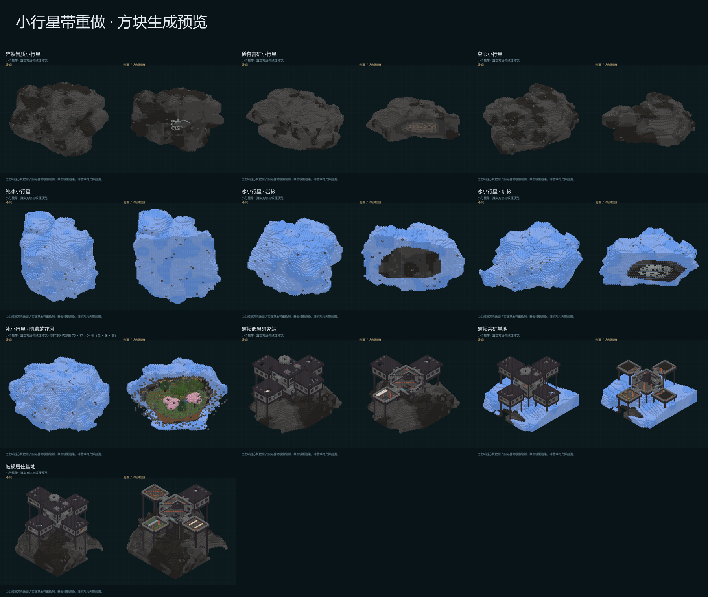
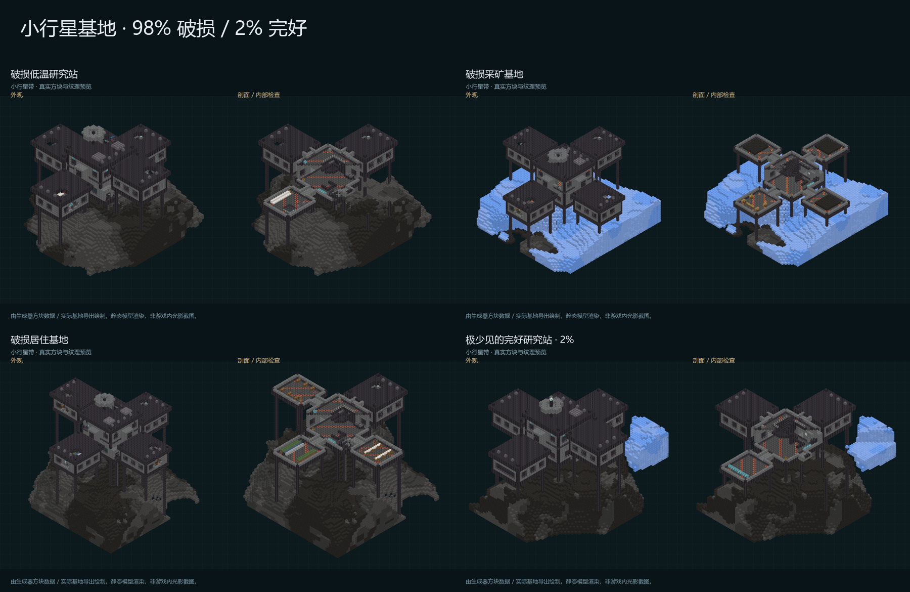

# 小行星带重做

实现日期：2026-10-06；棱角柔化与常见散生矿物修订：2026-10-07。维度 ID 保持 **`sdbf:asteroid_belt`**，高度仍为 Y=0–319，原群系 ID 和轨道维度保持不变。

## 地形与生态

不规则岩质小行星、稀有富矿小行星、空心小行星和冰小行星共同组成空间地形。每个天体由独立倾斜的断面与偏移、不同轴长的碎裂岩体组合，叠加侵蚀缺口、撞击坑和大小两级表面起伏。形状、朝向、高宽比、矿核位置、内部空腔和材料分布都由种子独立确定。岩石材质采用不规则斑块、角砾和矿脉分布；三种小行星岩石方块各有 16 种随机模型旋转，减少纹理重复。

切面交汇处现在有窄幅弧形过渡，外壳、岩体、内部空腔和矿核的硬折角都得到轻微柔化。切面倾斜、偏移岩体、撞击坑和表面噪声保留，天体布局、连续尺寸分布与类型概率保持原配置。相同种子、相同位置的七类预览样本中，实体方块总数减少约 **2.94%–4.86%**，反映本次修订的小幅度；这不是整个维度的体积统计。花园依然有完整岩壳与冰壳。

普通主天体的基础半径连续抽取 **6–80 格**，伴生天体连续抽取 **2.5–41.5 格**，再按随机轴长比例、碎裂轮廓和侵蚀改变实际大小。各个区间都可能生成，尺寸不分固定档位。

主天体布局单元由 224 格缩至 192 格，伴生天体的出现概率由 27% 提至 68%，伴生单元调整为 64 格，并扩大伴生天体的尺寸范围。在相同种子、相同 2048×2048 区域的比较中，中心位于区域内的天体从 **1001 增至 2011**；1024 个随机竖直列中有天体的列从 **141 增至 376**。这是固定样本的生成统计，各区域实际分布会有所变化。

花园小行星的外层也具有不规则隆起和缺口，但壳层生成保留完整包裹生态圈的最低厚度。高度边界会随外形计算，并将天体中心限制在可容纳的位置，避免顶部或底部被世界边界削平。

以下为主体类型的抽取概率，周围碎石不计入此表：

| 类型 | 概率 | 内容 |
|---|---:|---|
| 岩质 | 54% | 不规则材料斑块、角砾、矿脉，部分带内部孔洞或小矿核 |
| 富矿 | 6% | 19 种旧版矿物之一，偏心矿核与原有内层、夹层和外壳材料 |
| 空心岩质 | 10% | 偏移、带起伏的多面空腔与厚岩壳 |
| 纯冰 | 11% | 浮冰、蓝冰与少量透明冰脉 |
| 冰壳岩核 | 7% | 冰壳内部为岩石核心 |
| 冰壳岩核与矿核 | 6% | 不规则岩核内部混有矿石 |
| 隐藏的花园 | 6% | 外层冰壳、内层岩壳共同包围的小型生态圈 |

花园包含草方块、橡树/白桦/云杉/樱花树、草、蕨和花卉。地面与顶壁嵌入萤石；微型河流和池塘分别随机出现，也可能都不出现。植物限制在空腔以内，河床、池底和岸边封闭。

花园小行星的基础半径范围已由 47–60 格缩小为 **23.5–40 格**：最小尺寸为原来的 1/2，最大尺寸为原来的 2/3。长短轴、生态圈和包裹壳层随主体大小缩放；树木高度按洞内可用空间调整。

生态圈四周、顶部与土层下方由连续的岩壳包围，外面再覆盖冰壳。岩壳使用原有三种小行星岩石，带有不规则材料斑块和起伏边界，并随花园尺寸缩放。顶壁萤石嵌在岩壳中。空腔与包裹壳层预留独立空间，邻近天体不会填入花园。

富矿小行星恢复了旧版全部 **19 种**：硼、煤、钴、铜、戴斯、钻石、铁、青金石、铅、锂、镁、镍、紫金、铂、红石、银、钍、锡、铀。各自的核心、内层、替代内层、中层、外层方块均从旧版配置读取；铜核仍使用粗铜块。煤、铁、铜等普通资源权重较高，钻石及部分后期金属权重较低。

富矿小行星在主天体中的抽取概率为 **6%**，伴生天体中的概率为 **3%**；增加的密度主要分配给普通岩石和冰质天体。上述区域样本中仅有 50 个富矿天体，占 2011 个天体的约 **2.5%**。

### 常见散生矿物

所有七类主体与小型伴生小行星的岩石、冰质方块和矿物外层都有 **1% 的逐方块生成概率**，内部与表面采用同一概率，不限制高度、深度或距离矿核的位置。以单块零散分布为主，偶尔相邻；同一小行星可以混合出现多种矿物。原有矿核保留，花园的草地、土层、水、植被和萤石也保留；花园小行星的散生矿物位于岩壳与冰壳。

以下权重用于已经抽到散生矿物的位置，合计 100：

| 矿物 | 方块 | 权重 |
|---|---|---:|
| 铁 | `minecraft:deepslate_iron_ore` | 30 |
| 镍 | `thermal:deepslate_nickel_ore` | 20 |
| 铜 | `minecraft:deepslate_copper_ore` | 20 |
| 锡 | `thermal:deepslate_tin_ore` | 12 |
| 铅 | `thermal:deepslate_lead_ore` | 10 |
| 煤 | `minecraft:deepslate_coal_ore` | 8 |

配置位于 `kubejs/data/sdbf/dimension/asteroid_belt.json` 的生成器字段 `scattered_ore_chance` 与 `scattered_ores`。抽取使用世界种子与坐标哈希，随区块生成写入；矿石表在生成器创建时预先整理。富矿小行星的类型概率、旧版 19 种矿物层、圆角和天体密度沿用此前配置。

### 太空环境与性能

在本维度跳过 Ad Astra 的区块环境方块处理，以保留草方块、植物和液态水。实现是一次维度 ID 判断，没有定时补水、逐株保护或氧气机扫描。原有角色氧气需求、低温、低重力和辐射设定继续生效。

生成器按区块筛选附近天体，仅在天体高度范围内计算密度，批量写入区段；主体、伴生天体和花园计划使用有界缓存，花园计划按实际所在位置区分。花园植被按所在区块索引。旧的 23 项球状晶洞地物从本群系生成列表撤下；19 种矿物改由新的连续天体生成器生成。旧数据文件仍保留，供矿物材料配置读取和核对。

## 废弃基地

三类基地使用原版拼图池随机装配，主舱具有双层楼面、三格宽折返楼梯，并强制至少一间下层翼舱和一间上层翼舱。结构落在合适大小的小行星上，支柱与外部检修梯连接岩面；不会在花园小行星上放置基地。选址逐块检查房间、出入口附近与屋顶上方空间，拒绝会被邻近天体侵入的布局。

基地按 **98% 破损、2% 完好** 配置。每个候选位置只决定一次整座基地的状态，主舱与翼舱使用对应的拼图池；重新尝试布局不会重新抽取完好概率。三类基地共 48 个模板、18 个拼图池，每类有三种破损主舱和每种翼舱的两种破损版本。损坏包括舱壁与窗面的缺口、贯穿双层屋顶的撞击破口、断裂天线和遗失设备；楼梯和主要通路保留。

| 基地 | 可随机出现的翼舱 | 专属战利品示例 |
|---|---|---|
| 低温研究站 | 实验室、储藏室、观察室、温室 | 逻辑线缆、萤石粉、紫水晶、蓝冰、低概率末影珍珠 |
| 采矿基地 | 钻探间、维修间、储藏室、宿舍 | 粗铁、粗铜、煤、低概率钻石与紫金锭 |
| 居住基地 | 宿舍、食堂、温室、储藏室 | 食物、骨粉、树苗、低概率金胡萝卜 |

外壳、地板、楼梯、走廊、支柱和外部检修梯使用金属与玻璃，主要为 Quark 铁板、铁梯及 Ad Astra 钢板、铁面板、装饰面板、通风结构；木制方块仅用于室内家具，例如床、书架、箱桶和食堂座椅。少量英文 PneumaticCraft 格言牌提供废弃基地的背景信息。不使用绳圈。

入口使用两道 **3×3 Ad Astra 钢制滑动密封门**，中间为气闸。门默认关闭，使用原模组的交互与动画。走廊有连续底板、侧壁和顶板，未连接的拼图接口会封闭。完好基地保持气密；破损基地仅允许明确设计的破口漏气。实际检查中临时修复这些破口后，所有舱室及连接部分都通过了 Ad Astra 自身的气密判定。

每座基地屋顶至多保留一块太阳能板。采矿基地的维修间可有 0–2 台 Ad Astra 机器（压缩机、燃煤发电机）与三格短钢制能量线缆，部分破损版本会遗失机器或线缆。设备使用原模组的方块实体和能量接口，初始不附带燃料、库存或储能；玩家可以修复和使用。气密检查不表示基地已配置供氧系统。

每座基地的主舱有一个 Apotheosis Boss 刷怪笼。主舱、实验室和储藏室可带战利品箱，普通家具桶为空；箱子抽取 3–5 次，包含少量钢锭、铁锭、红石、食物等公共物资，不含附魔书。

基地采用共享的随机分布结构集：间距 28 区块、最小间隔 12 区块、候选频率 0.75。还要通过天体大小、距离、高度和上下层布局检查，所以不是每个候选位置都有基地。

结构 ID：

```text
sdbf:asteroid_belt/research_base
sdbf:asteroid_belt/mining_base
sdbf:asteroid_belt/habitation_base
```

可在小行星带内用 `/locate structure <上述ID>` 定位。原本允许在该群系生成的其他模组结构仍走原版结构流程；本轮实际测试覆盖上述三类新基地。

## 预览

预览来自生成器方块快照与运行环境中实际自然生成的基地，使用已安装纹理绘制。右侧为剖面，不表示实际生成时缺墙或缺冰壳。它们是静态模型图，不是游戏内光影截图；流体、方块实体与光照使用简化显示。





- [小行星棱角柔化：相同种子前后对比](previews/rounding_comparison.png)

- [隐藏的花园](previews/garden.png)
- [空心岩质小行星](previews/hollow.png)
- [稀有富矿小行星](previews/mineral.png)
- [低温研究站](previews/research_base.png)
- [采矿基地](previews/mining_base.png)
- [居住基地](previews/habitation_base.png)
- [极少见的完好研究站](previews/intact_base.png)

## 验证与安装

2026-10-07 常见散生矿物修订在独立 Forge 世界 `asteroid-scattered-ores-v1` 完成：

- 六种矿物的实际注册方块、权重及 1% 概率配置读取通过。
- 七类主体及岩质、冰质伴生天体分别检查；样本散矿率为 0.931%–1.038%，每种样本都有表面和内部矿石。
- 每种样本在实际 FULL 区块中验证三处表面矿石和三处内部矿石，共 54 处；散矿以孤立方块为主。
- 草地、土层、水、萤石、原有矿核保持原方块；花园植被存活、池河密封及太空环境处理通过。
- 七类实际区块、4096 次地形列与高度检查、四工作线程的一致性、全部 19 种旧版矿核及三类基地的门、楼梯、气密检查通过。
- Gradle `build` 成功；安装核对仅生成器相关类、构建清单与维度 JSON 的两个散矿字段变化，形状和基地代码保持此前版本。

报告见 `local/asteroid_belt_work/verification/report.txt`，矿石统计见 `local/asteroid_belt_work/verification/scattered_ore_counts.json`。运行与构建日志在 `local/asteroid_belt_work/runtime-scattered-ores.log` 和 `local/asteroid_belt_work/build-scattered-ores.log`；安装核对记录在 `local/asteroid_belt_work/verification/scattered_ores_install_audit.json`。

2026-10-06 基地修订使用独立 Forge 服务端、新建测试世界完成：

- 48 个 NBT 模板的 1029 项方块状态注册检查，以及模板外部无木制方块检查。
- 三类破损基地和一座极少见的完好研究站实际自然生成，验证随机布局、结构保存读取、屋顶空间、战利品箱与标准 0.6 格跨步玩家上下楼梯。
- 使用真实 Ad Astra 气密算法检查舱室、走廊与入口：三座破损样本分别有 291、295、296 个标记破口方块；仅修复这些设计破口后不存在其他漏气。完好样本没有破口，直接通过气密检查。
- 两道 3×3 滑动密封门的九个部件、旋转、原生交互、开关动画和玩家通行通过；双门关闭或只打开一道门时，舱内与气闸的相应密封检查通过。
- 10000 个候选位置中 214 个抽到完好状态，与配置的 2% 概率相符；布局尝试不会重复抽取概率。
- 太阳能板、压缩机、燃煤发电机与三格钢制线缆使用真实方块实体，原生更新和能量接口检查通过。
- 最终 Gradle `build` 成功，原有世界树几何与末地生成兼容检查通过。jar 内容比较仅有基地生成器的两个类与构建清单变化。

该次报告保存于 `backups/asteroid_rounding_before/local/asteroid_belt_work/verification/report.txt`。其他日志仍在 `local/asteroid_belt_work/template-sealing.log`、`local/asteroid_belt_work/runtime-base-refit.log`、`local/asteroid_belt_work/build.log` 和 `local/asteroid_belt_work/verification/base_refit_install_audit.json`。

2026-10-07 棱角柔化在独立测试世界 `asteroid-rounding-v1` 重新通过以下生成检查：

- 625 个主体的类型分布、不同种子和四工作线程生成一致性检查。
- 岩壳补充检查：三个种子的 110 个花园、28,160 条径向采样路径均穿过连续岩层和外层冰；岩壳未侵入生态圈内部。
- 4096 次高度/地形列检查；七类天体的实际 FULL 区块与生成器列数据对照。
- 全部 19 种旧版矿物在实际 FULL 区块中找到矿核；原有五种材料层与 59 个加权目录条目核对通过。
- 湿润花园样本：8 棵树、429 个植物方块、28 个地面萤石、160 个水方块；边界、植物存活、河池密封与流体更新检查通过。
- 实际生成样本中最小与最大花园分别有 8 棵与 14 棵树，生态检查通过；36 个花园的植被计划均位于各自空腔内。
- 调用真实 Ad Astra 区块环境处理 15000 次：本维度 128/128 水源保留，月球对照组 0/128；本维度草和蕨保留。
- 三类破损基地实际自然生成，屋顶空间、楼梯、双道密封门、原生气密判定与太阳能板检查通过。
- Gradle `build` 成功；原有世界树与末地检查通过。与修订前 jar 比较，仅小行星形状代码及构建清单变化。

棱角柔化报告保存在 `backups/asteroid_scattered_ores_before/local/asteroid_belt_work/verification/report.txt`；详细日志在 `local/asteroid_belt_work/runtime-rounding.log`、`local/asteroid_belt_work/geometry-rounding.log`、`local/asteroid_belt_work/build-rounding.log`。安装核对和相同天体的方块数量对比在 `local/asteroid_belt_work/verification/rounding_install_audit.json` 与 `local/asteroid_belt_work/verification/rounding_voxel_comparison.json`。此前地形几何和密度比较日志仍在 `local/asteroid_belt_work/geometry-variety.log`、`local/asteroid_belt_work/variety-old.log` 与 `local/asteroid_belt_work/variety-new.log`。本轮未运行客户端光影场景或完整整合包的载图性能基准。

运行文件：

- `mods/slashblade_sendims-1.0.22.jar`
- `kubejs/data/sdbf/dimension/asteroid_belt.json`
- `kubejs/data/sdbf/dimension_type/asteroid_belt_type.json`（环境亮度微调为 0.08）
- `kubejs/data/sdbf/worldgen/biome/asteroid_belt/asteroid_belt.json`
- 新增的结构、拼图池、模板、战利品表和群系标签均在 `kubejs/data/sdbf/` 下。
- 三种岩石的随机模型旋转在 `kubejs/assets/kubejs/blockstates/` 与 `kubejs/assets/kubejs/models/block/` 下。

**完全重启游戏后，在新生成区块生效。** 未删除或改写玩家存档中的已有区块。此前文件备份位于 `backups/asteroid_belt_before/`，`data_manifest.json` 记录新增与覆盖的文件。

本次基地修订前的 jar、基地生成器源码、模板作者脚本、文档和上一轮验证报告备份在 `backups/asteroid_base_refit_before/`。该目录的 `data_manifest.json` 记录 27 个覆盖文件与 42 个新增文件。已安装的 77 个小行星带数据文件全部通过哈希核对，维度 ID 与原有地形配置保持不变。

棱角柔化前的 jar、形状源码、维度配置、文档、报告和七类预览快照备份在 `backups/asteroid_rounding_before/`，`manifest.json` 记录其哈希。棱角柔化修订仅更新了模组 jar。

常见散生矿物修订前的 jar、生成器源码、维度配置、作者脚本、文档与报告备份在 `backups/asteroid_scattered_ores_before/`。本次更新模组 jar 和维度 JSON 的两个散矿字段，已安装的 77 个数据文件全部通过哈希核对。

本次随机外形、连续尺寸、增密与稀有富矿修订前的 jar、生成器源码、维度配置和验证报告存于 `backups/asteroid_variety_before/`。`data_manifest.json` 记录本次覆盖的配置和新增资源文件。

花园尺寸缩小前的版本另存于 `backups/asteroid_garden_size_before/`。

Java 源码已同步至 `C:/Users/Tony/Documents/EX/ForgeDev/SlashBlade-SenDims`；模板作者脚本、生成器源码副本、运行验证与渲染脚本保存在 `local/asteroid_belt_work/`。

## 参考

用户指定的 [MC 百科小行星条目](https://www.mcmod.cn/item/10201.html) 本轮无法直接读取，因此通过 [Galacticraft 原始小行星生成器](https://github.com/micdoodle8/Galacticraft/blob/master/src/main/java/micdoodle8/mods/galacticraft/planets/asteroids/world/gen/ChunkProviderAsteroids.java) 核对空腔、冰壳、草地、树木和萤石的设计。当前形态和生成算法为本整合包重新实现。
